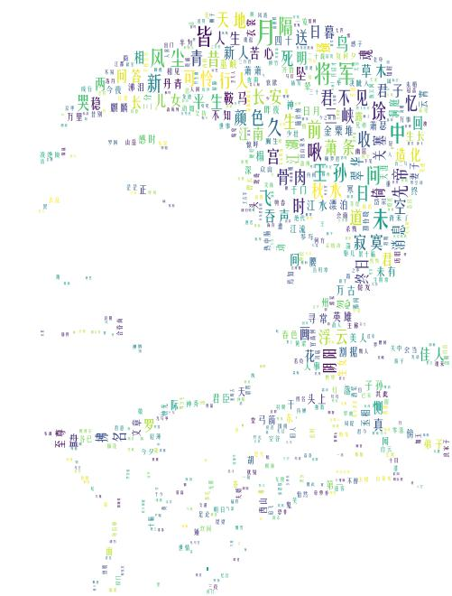

环境：
- win10
- pycharm
- tensorflow-gpu1.8
- python3.6
- matplotlib.pyplot 
- jieba
- snownlp
- re
- wordcloud
- scipy.misc 
- os
- pylab

poetry.py 为生成古诗的代码文件
train_lstm.py为训练模型的文件
module 为生成的模型
poetry.txt 为古诗的文本文件

随机生成古诗命令：

`python poetry.py 1`

生成藏头诗的命令:

`python poetry.py 2 content 5/7`

content为藏头诗的内容

5/7为五言诗或者七言诗

比如：
`python poetry.py 2 姚老师帅 5`

结果：

姚二虚浓剑，千里复相辇。

老缘犹今去，酌但堂翠根。

师没西惑子，客看成便何。

帅衣初满地，珠笛漱丹天。

