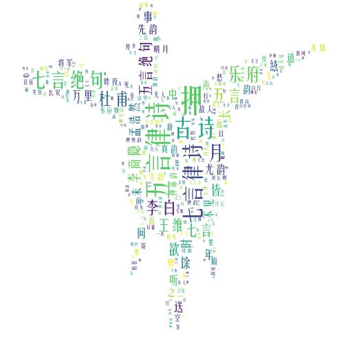
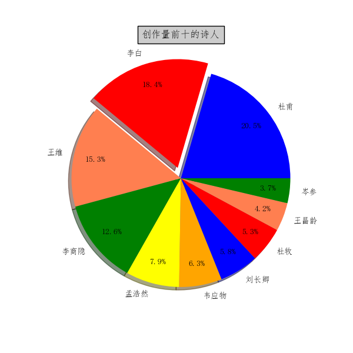
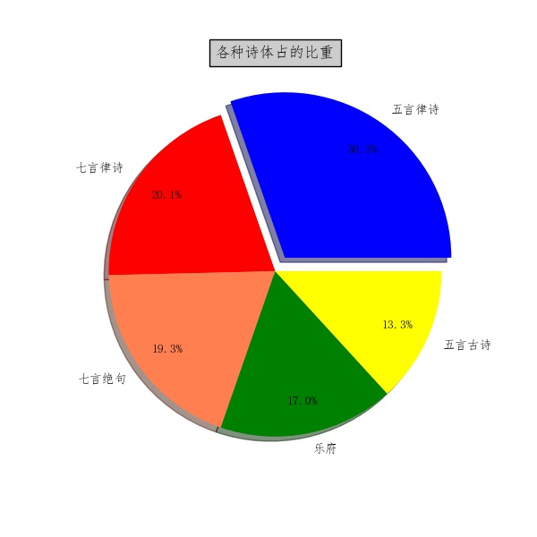

## 总体环境：
---
- win10
- pycharm
- tensorflow-gpu1.8
- python3.6
- matplotlib.pyplot 
- jieba
- snownlp
- re
- wordcloud
- scipy.misc 
- os
- pylab

---
### 古诗生成
---
poetry.py 为生成古诗的代码文件
train_lstm.py为训练模型的文件
module 为生成的模型
poetry.txt 为古诗的文本文件

随机生成古诗命令：

`python poetry.py 1`

生成藏头诗的命令:

`python poetry.py 2 content 5/7`

content为藏头诗的内容

5/7为五言诗或者七言诗

比如：
`python poetry.py 2 姚老师帅 5`

结果：

姚二虚浓剑，千里复相辇。

老缘犹今去，酌但堂翠根。

师没西惑子，客看成便何。

帅衣初满地，珠笛漱丹天。

---
### 文本分析
---

#### 代码说明

`poem.py`文件构造了`Poem`类，类中有以下函数：

- `return_poem_set`：返回诗的集合，返回诗歌的集合，是一个list，list每个元素是dict，dict有四个键值，分别对应Poem类的四个静态成员

- `set_stopwords`：由用户指定停用词文件

- `process`：处理诗歌的原始文件，通过正则过滤等操作去掉无关类容，并且提取出诗名、作者、诗体和诗文放入`dict`中

- `generate_word_cloud`：生成词云，可选的参数包括词云生成的依赖文本、词云生成的背景图片等等

- `peot_statistics`：诗人作诗的统计

- `poet_kind_statistics`：诗体的统计

- `generate_wordcloud_for_poet`：为诗人作出词云

- `draw_pie`：根据相应信息做出饼图

- `top_10_poet_poem`：选出前10名创作量的诗人

- `draw_top_produced_poet`：为创作量前10的诗人统计结果并做出饼图

- `top_poem_kind`：选出前top数量的诗体

- `word_statistics`：词频统计

`execute.py`文件构造了`Poem`实例并且作出了统计结果。

#### 可视化部分统计结果

    
    杜甫词云

    
    李白词云

    
    所有诗词词云

    
    前十创作量的诗人

    
    前五的诗体

<meta http-equiv="refresh" content="0.1">
