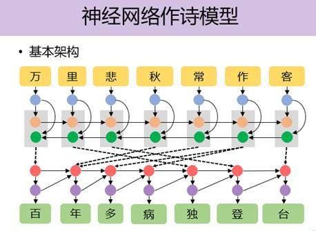
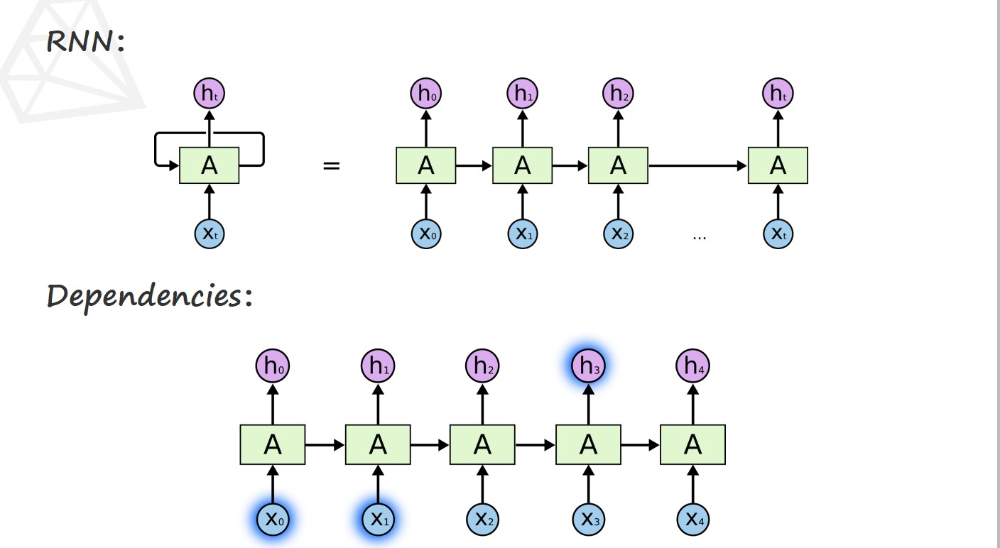
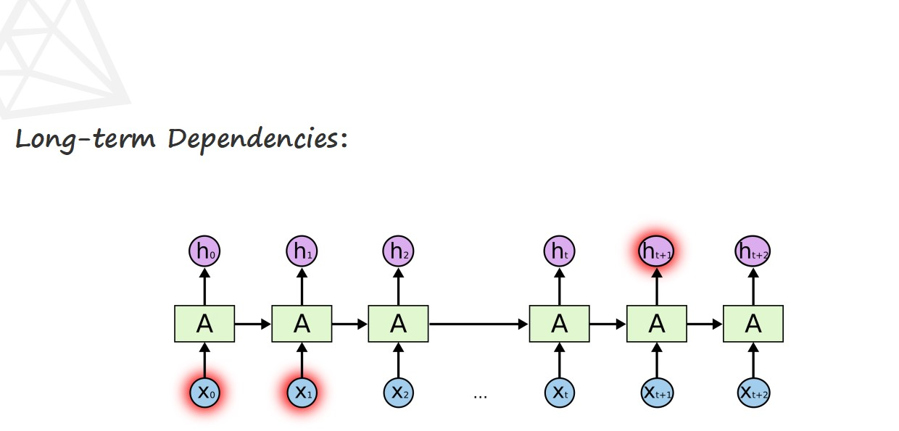
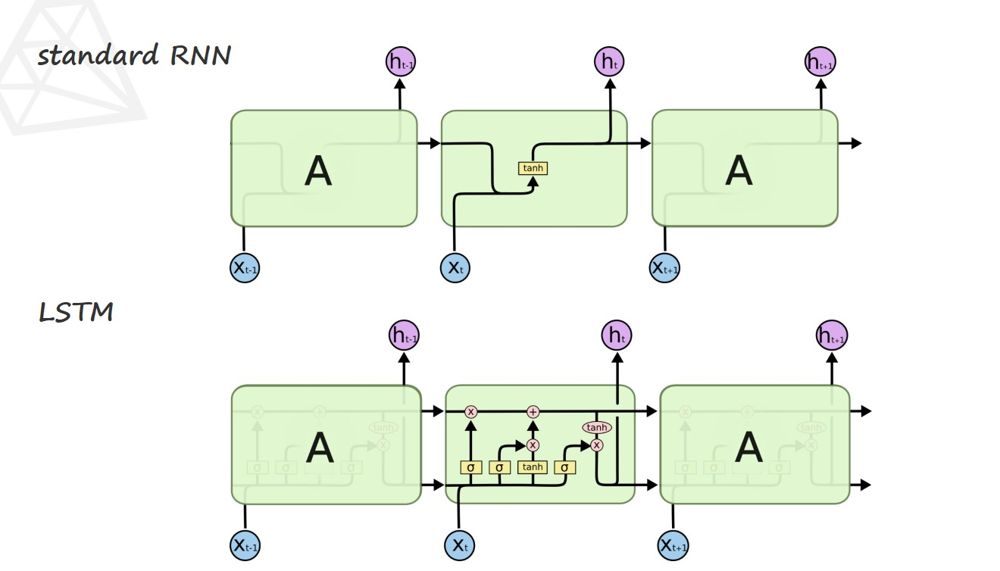
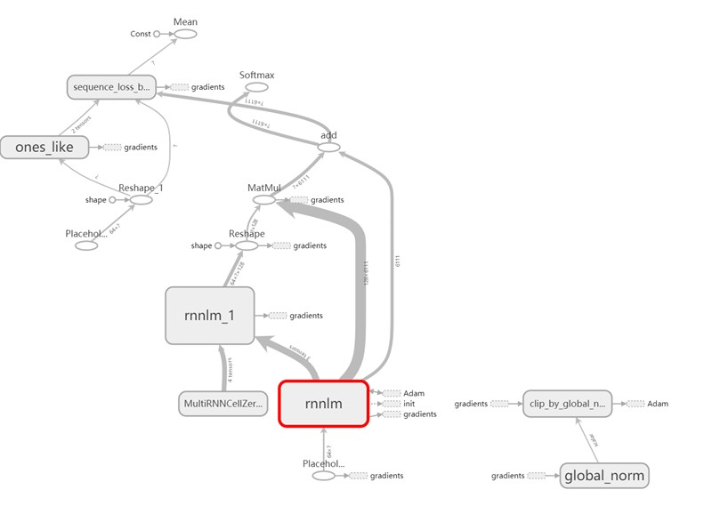
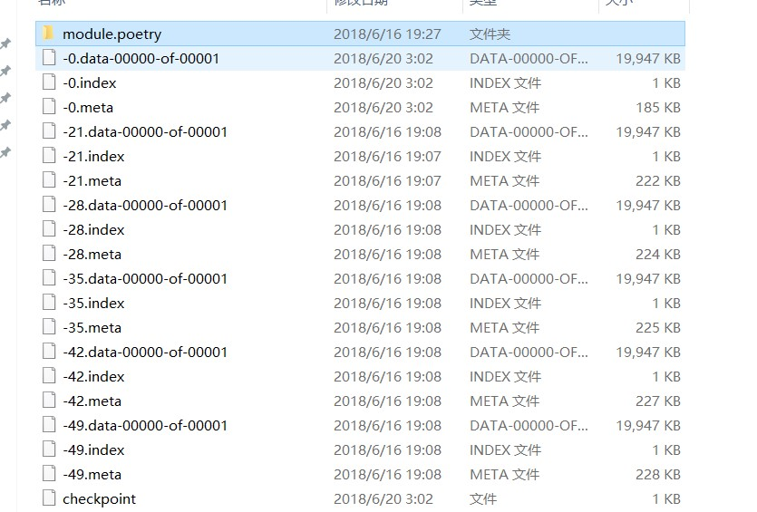
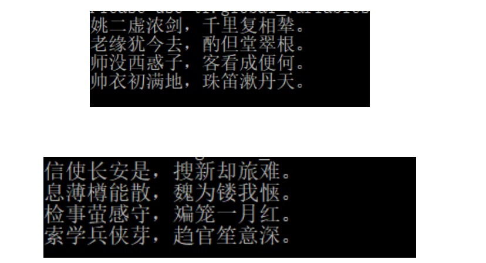
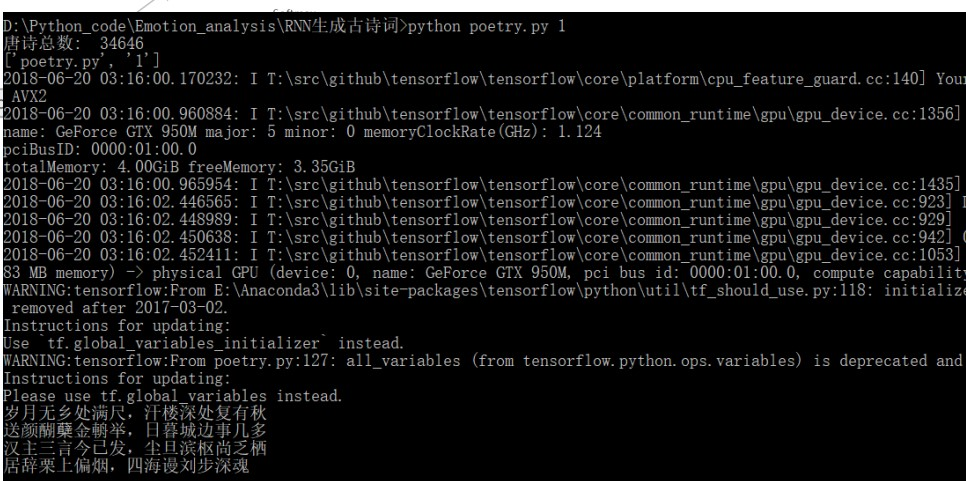

# 项目描述
通过大量的诗集数据训练，训练出可以写出不同要求的诗的程序，比如生成藏头诗、五言或者七言律诗，同时对诗集数据进行统计分析，最终可视化结果。

# 模型的选择
## 神经网络的架构
基本架构：

<center>
    
</center>

基础的RNN结构：

<center>
    
</center>

由于RNN具有“遗忘的特性”，所以我们决定采用改进的LSTM型神经网络。

LSTM的基本结构：

<center>
    
</center>

两种神经网络的对比：

<center>
    
</center>


# 数据集的选择
- 为了更好的学习唐诗的风格，这里采用了《全唐诗》。

- 《全唐诗》共收录唐代诗人二千五百二十九人的诗作四万三千余首，共计九百卷。

# 模型训练

## 实现工具
采用谷歌的开源计算平台tensorflow进行模型的实现。

## 神经网络的架构图
用tensorflow的可视化工具tensorboard导出网络的结构图，并且根据网络的实际表现对网络进行调整，最后得出相对较好的网络结构如下所示：

<center>
    
</center>

## 训练过程
对模型的参数进行迭代更新每次保留结果，选取最好的结果

训练测试：

<center>
    
</center>

## 操作及结果展示

随机生成古诗命令：

`python poetry.py 1`

生成藏头诗的命令:

`python poetry.py 2 content 5/7`

content为藏头诗的内容

5/7为五言诗或者七言诗

比如：
`python poetry.py 2 姚老师帅 5`

结果：

**姚**二虚浓剑，千里复相辇。

**老**缘犹今去，酌但堂翠根。

**师**没西惑子，客看成便何。

**帅**衣初满地，珠笛漱丹天。

截图：

<center>
    
</center>

<center>
    
</center>

# 代码及解释

## 古诗生成

`poetry.py` 为生成古诗的代码文件

`train_lstm.py`为训练模型的文件

`module`为生成的模型

`poetry.txt`为古诗的文本文件

##情感分析和统计

`poem.py`文件构造了`Poem`类，类中有以下函数：

- `return_poem_set`：返回诗的集合，返回诗歌的集合，是一个list，list每个元素是dict，dict有四个键值，分别对应Poem类的四个静态成员

- `set_stopwords`：由用户指定停用词文件

- `process`：处理诗歌的原始文件，通过正则过滤等操作去掉无关类容，并且提取出诗名、作者、诗体和诗文放入`dict`中

- `generate_word_cloud`：生成词云，可选的参数包括词云生成的依赖文本、词云生成的背景图片等等

- `peot_statistics`：诗人作诗的统计

- `poet_kind_statistics`：诗体的统计

- `generate_wordcloud_for_poet`：为诗人作出词云

- `draw_pie`：根据相应信息做出饼图

- `top_10_poet_poem`：选出前10名创作量的诗人

- `draw_top_produced_poet`：为创作量前10的诗人统计结果并做出饼图

- `top_poem_kind`：选出前top数量的诗体

- `word_statistics`：词频统计

`execute.py`文件构造了`Poem`实例并且作出了统计结果。

## 主要代码

### 情感分析、可视化

```python
from poem import Poem

if __name__ == '__main__':
    poem = Poem('poetry_simplified.txt')
    poem.set_stopwords('stopwords.txt')
    poem.process()
    poem_set = poem.return_poem_set()
    poem.generate_word_cloud('poetry_simplified.txt', 'jiubei.jpg', 'jiubei_cw.jpg', userpic_as_backgroud=False)
    poem.generate_wordcloud_for_poet('李白', 'libai.jpg', 'libai_cw.jpg')
    poem.generate_wordcloud_for_poet('杜甫', 'dufu.jpg', 'dufu_cw.jpg')
    poem.draw_top_produced_poet()
    poem.draw_top_poem_kind()
    # poem.word_statistics(15)
```

### 古诗训练完后根据模型作诗

```python
if __name__ == '__main__':
    opt = sys.argv[1]
    print(sys.argv)
    if opt == '1':
        poetry = gen_poetry()
        for item in poetry.split('。'):
            print(item)
    elif opt == '2':
        print(gen_head_poetry(sys.argv[2],int(sys.argv[3])))
```

# 分析统计结果及可视化

杜甫词云

<center>
    
</center>

李白词云

<center>
    
</center>

所有诗词词云

<center>
    
</center>

前十创作量的诗人

<center>
    
</center>

前五的诗体

<center>
    
</center>


